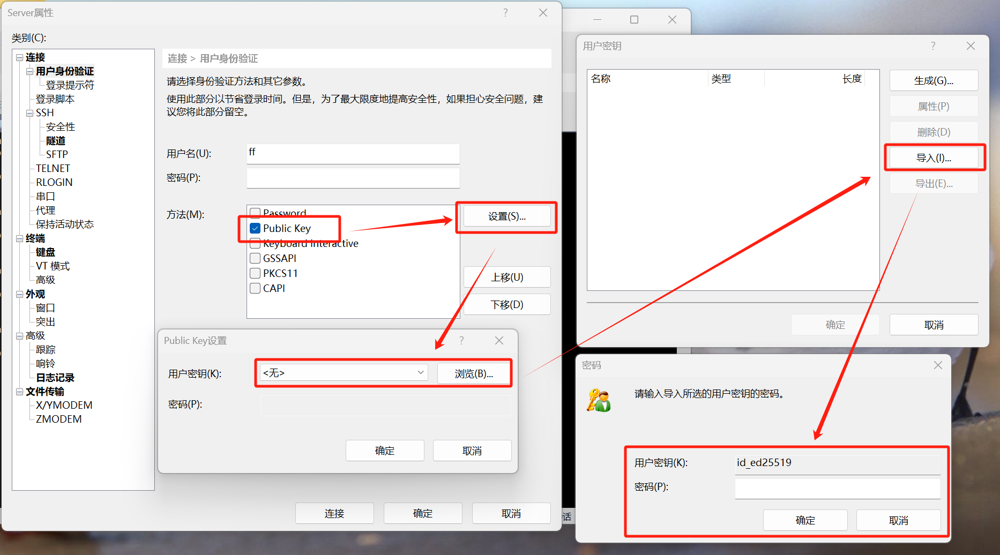

# 实验室服务器使用指南

服务器是课题组同学共有的计算资源，使用前请阅读本文档，了解服务器的使用方法和注意事项。

| 编号  | 原名称 | IPv4 地址       | 配置         |
| --- | --- | ------------- | ---------- |
| ①   | 117 | 10.108.119.92 | 4x RTX3090 |
| ②   | 64  | /             | /          |
| ③   | 47  | /             | /          |

## 登录认证方式

!!! warning
    由于安全隐患原因，我们已经禁止 SSH 连接使用密码认证！

使用 SSH 公钥认证登录：

- 公钥认证是一种比密码/口令更加安全的认证方式，它基于非对称加密算法。算法使用成对的公钥和私钥，其中，公钥用于加密数据，它可以安全公开；私钥用于解密数据，需要用户妥善保存，不能透露给任何人。
- 用户在客户机上生成密钥对之后，将公钥上传至服务器。需要连接认证时，服务器会让登录方对指定内容解密，如果登录方能够正确解密，那么就证明了登录者的身份。

公钥认证的优势：

- **非常安全**：私钥只存在于用户本地，不会以任何形式进入网络。只要攻击者拿不到私钥，无论如何也认证不了，永远杜绝弱密码问题
- **连接方便**：不需要记忆和输入密码，使用 ssh-agent 工具后，连 passphrase 都不用敲

## SSH 公钥认证操作方法

!!! info "太长不看"
    使用 `ssh-keygen` 创建密钥对，然后把自己机器上的 `~/.ssh/id_ed25519.pub` 文件发送给管理员

推荐参考 [GitHub 文档](https://docs.github.com/zh/authentication/connecting-to-github-with-ssh)，它提供了非常详细的教程。虽然这个教程用于连接 GitHub，但关于 SSH 密钥对的操作方法是适用的。

在 Windows 机器上使用公钥认证的方法大致如下：

1. 检查已有密钥，通常存放在 `~/.ssh` 目录下，应该有类似 `id_ed25519.pub` 的文件
2. 若没有，参考 [教程](https://docs.github.com/zh/authentication/connecting-to-github-with-ssh/generating-a-new-ssh-key-and-adding-it-to-the-ssh-agent#generating-a-new-ssh-key) 生成一份密钥对，推荐使用 ED25519 密钥
3. 拷贝你的公钥 (文件名以 `.pub` 结尾) 到服务器 `~/.ssh/authorized_keys` 文件中
	1. 必须是你账户自己的家目录
	2. 如果没有，请使用 `mkdir .ssh/` 和 `touch authorized_keys` 自行创建
	3. 文件中，一行代表一个 SSH 公钥，它应该以 `ssh-ed25519` 开头，后面跟一个随机字符串
	4. 保证这个文件你自己有权限，可以使用命令 `chmod 600 ./authorized_keys` 修改
4. 如果不想每次连接都输入 passphrase，可以参考 ssh-agent 的 [使用方法](https://docs.github.com/zh/authentication/connecting-to-github-with-ssh/generating-a-new-ssh-key-and-adding-it-to-the-ssh-agent#adding-your-ssh-key-to-the-ssh-agent)

其他事项：

可以给自己的用户上传多个公钥，供多个设备使用。也可以把自己手里的密钥对通过物理拷贝的方式，在多台设备中使用。

对于命令行以外的客户端（例如 WinSCP, XShell 等），可以使用类似下图的方式设置公钥认证。导入时，需要使用私钥文件。



## 使用贴士

**【必读】** 我们的 3090 机器使用注意事项：

1. 机器的 SSD 挂载于根目录下，容量较小，而我们的机械硬盘空间较为充裕，挂载于 `/home1` 目录。如有大体积数据或模型（例如 10 GB 以上），建议保存于 `/home1/<user>` 文件夹下，以防止根目录盘爆空间。
2. **请尽量避免使用 0 号 GPU！** 服务器机器散热较差，若长期连续高功率运转会让温度突破 90 度，硬件会强制下电自我保护，这时候就只能重启服务器。单卡任务请使用环境变量 `CUDA_VISIBLE_DEVICES` 来选择特定 GPU；多卡任务请密切关注各卡的温度，**若超过 90 度请立刻停止进程**。

环境配置相关：

- Python 运行环境建议在自己的家目录下安装 miniconda，让虚拟环境与其他用户相隔离
- Docker 环境：普通用户没有权限使用 docker，可以让同学帮你加入 docker 用户组（获取访问 docker 的权限），或者直接切 root 操作（麻烦一点）
- 其他相关软件包涉及 apt 的，获取 root 权限后请慎重操作

## 校园网认证

当机器无法访问互联网时，可能是由于没有过校园网认证。我们提供了命令行工具 `bitsrun` 来登录校园网，该工具来自开源项目 [bitsrun-rs](https://github.com/spencerwooo/bitsrun-rs)。

请参考 [该文档](https://github.com/spencerwooo/bitsrun-rs?tab=readme-ov-file#config-and-credentials) 配置你的校园网账户。配置文件位于 `~/.config/bitsrun/bit-user.json`，以下是一个示例文件，其中的用户名密码和你在 10.0.0.55 认证页面输入的相同。

```json
{
  "username": "<username>",
  "password": "<password>",
  "dm": true,
  "poll_interval": 600
}
```

若希望保持校园网登录状态，可以使用以下命令挂一个后台进程：

```shell
nohup bitsrun keep-alive >> ~/Desktop/bitsrun.log 2>&1 &
```

## 服务器使用代理科学上网的方法

有时我们需要联网下载一些服务器不在中国大陆的资源，包括但不限于 GitHub 仓库、谷歌云盘文件等，可能会遇到网络问题无法成功下载。

我推荐你先尝试在自己的设备上下载文件，然后使用 `scp` / VSCode /WinSCP 等工具将下载好的上传到服务器中。注意大文件请移步 `/home1/<user>` 目录下。

如果你需要让特定进程使用代理科学上网，可以用环境变量临时设置代理地址为你自己机器的 Clash 端点。使用时注意检查 Clash 是否开放局域网、端口号是否正确。

```bash
export https_proxy=http://<你的主机ip>:7897 http_proxy=http://<你的主机ip>:7897
```

## 调整外置风扇功率模式的方法

请按照以下步骤操作：

1. 准备一台有网线插口的笔记本，以及一根网线，前往服务器机箱
2. 机箱背面总共有三个网线插口，其中有两个并列，不要插那两个，插另外一个
3. 笔记本开机，不联网，插入网线并观察机箱网线插口处亮灯
4. 笔记本打开浏览器，输入 BMC IP，应该是 192.168.1.2，如果不是的话，服务器开机时应该会在屏幕上显示一下，如果还是找不到，就需要进 BIOS 找设置
5. 顺利进入网页后，用户名和密码都是 ADMIN
6. 在配置中找到风扇 (Fan Mode)，一共有三个模式，按需调整并点击 Save 即可

实在解决不了请联系思腾合力售后。
